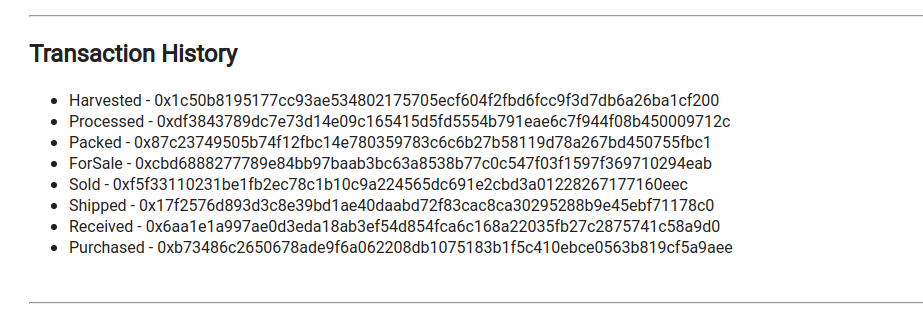

# Blockchain-Supplychain

## Supply chain & Data Auditing

This repository containts an Ethereum DApp that demonstrates a Supply Chain flow between a Seller and Buyer. The user story is similar to any commonly used supply chain process. A Seller can add items to the inventory system stored in the blockchain. A Buyer can purchase such items from the inventory system. Additionally a Seller can mark an item as Shipped, and similarly a Buyer can mark an item as Received.

The DApp User Interface when running should look like...





### Getting Started

These instructions will get you a copy of the project up and running on your local machine for development and testing purposes. See deployment for notes on how to deploy the project on a live system.

#### UML Diagrams


#### Prerequisites

Please make sure you've already installed ganache-cli, Truffle and enabled MetaMask extension in your browser.

```
Give examples (to be clarified)
```

#### Installing

A step by step series of examples that tell you have to get a development env running

Clone this repository:

```
git clone https://github.com/qazi-ejaz/Blockchain-Supplychain.git
```

Change directory to ```project-6``` folder and install all requisite npm packages (as listed in ```package.json```):

```
cd project-6
npm install
```

Launch Ganache:

```
ganache-cli -m "spirit supply whale amount human item harsh scare congress discover talent hamster"
```

Your terminal should look something like this:


In a separate terminal window, Compile smart contracts:

```
truffle compile
```

Your terminal should look something like this:


This will create the smart contract artifacts in folder ```build\contracts```.

Migrate smart contracts to the locally running blockchain, ganache-cli:

```
truffle migrate
```

Your terminal should look something like this:


Test smart contracts:

```
truffle test
```

All 10 tests should pass.


In a separate terminal window, launch the DApp:

```
npm run dev
```
### Demo:
All the aforementioned steps has been demonstrated in this gif step-by-step for the convenience of implementation and using the resources.


### Built With

* [Ethereum](https://www.ethereum.org/) - Ethereum is a decentralized platform that runs smart contracts
* [IPFS](https://ipfs.io/) - IPFS is the Distributed Web | A peer-to-peer hypermedia protocol
to make the web faster, safer, and more open.
* [Truffle Framework](http://truffleframework.com/) - Truffle is the most popular development framework for Ethereum with a mission to make your life a whole lot easier.

### Conclusion

The Dapp has been implemented on Rinkeby test network, and the transactions are logged in [etherscan](https://etherscan.io/) and can be verified and validated by using transaction ID of each event/action.
- Harvest
    - Token Address on the Rinkeby Network: 

| **Event/Action** | **Token Address on the Rinkeby Network** |
|---|---|
| Harvest Item | [0x1c50b8195177cc93ae534802175705ecf604f2fbd6fcc9f3d7db6a26ba1cf200](https://rinkeby.etherscan.io/tx/0x1c50b8195177cc93ae534802175705ecf604f2fbd6fcc9f3d7db6a26ba1cf200) |
| Process Item | [0xdf3843789dc7e73d14e09c165415d5fd5554b791eae6c7f944f08b450009712c](https://rinkeby.etherscan.io/tx/0xdf3843789dc7e73d14e09c165415d5fd5554b791eae6c7f944f08b450009712c)  |
| Pack Item | [0x87c23749505b74f12fbc14e780359783c6c6b27b58119d78a267bd450755fbc1](https://rinkeby.etherscan.io/tx/0x87c23749505b74f12fbc14e780359783c6c6b27b58119d78a267bd450755fbc1) |
| Sale Item | [0xcbd6888277789e84bb97baab3bc63a8538b77c0c547f03f1597f369710294eab](https://rinkeby.etherscan.io/tx/0xcbd6888277789e84bb97baab3bc63a8538b77c0c547f03f1597f369710294eab)  |
| Buy Item | [0xf5f33110231be1fb2ec78c1b10c9a224565dc691e2cbd3a01228267177160eec](https://rinkeby.etherscan.io/tx/0xf5f33110231be1fb2ec78c1b10c9a224565dc691e2cbd3a01228267177160eec) |
| Ship Item | [0x17f2576d893d3c8e39bd1ae40daabd72f83cac8ca30295288b9e45ebf71178c0](https://rinkeby.etherscan.io/tx/0x17f2576d893d3c8e39bd1ae40daabd72f83cac8ca30295288b9e45ebf71178c0)  |
| Receive Item | [0x6aa1e1a997ae0d3eda18ab3ef54d854fca6c168a22035fb27c2875741c58a9d0](https://rinkeby.etherscan.io/tx/0x6aa1e1a997ae0d3eda18ab3ef54d854fca6c168a22035fb27c2875741c58a9d0) |
| Purchase Item | [0xb73486c2650678ade9f6a062208db1075183b1f5c410ebce0563b819cf5a9aee](https://rinkeby.etherscan.io/tx/0xb73486c2650678ade9f6a062208db1075183b1f5c410ebce0563b819cf5a9aee) |

### Authors

See also the list of [contributors](https://github.com/your/project/contributors.md) who participated in this project.

### Acknowledgments

* Solidity
* Ganache-cli
* Truffle
* IPFS
